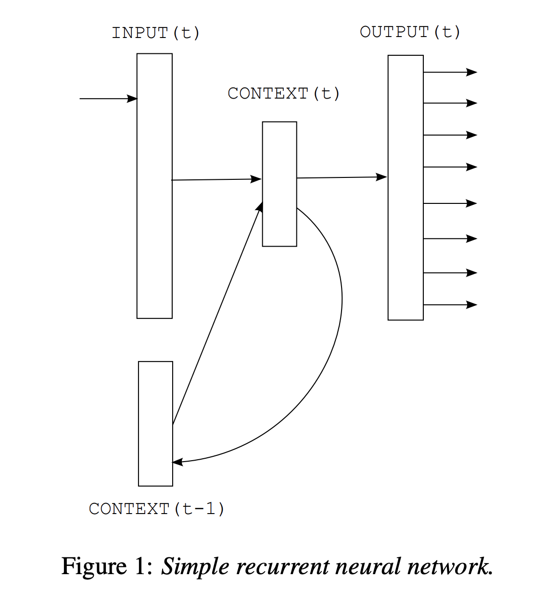
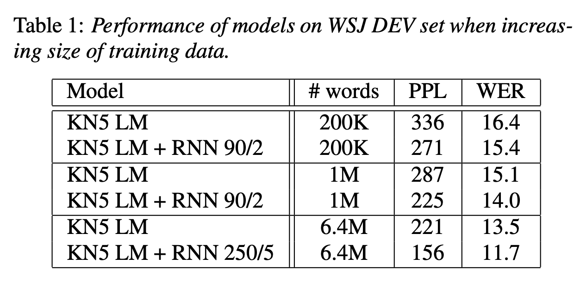
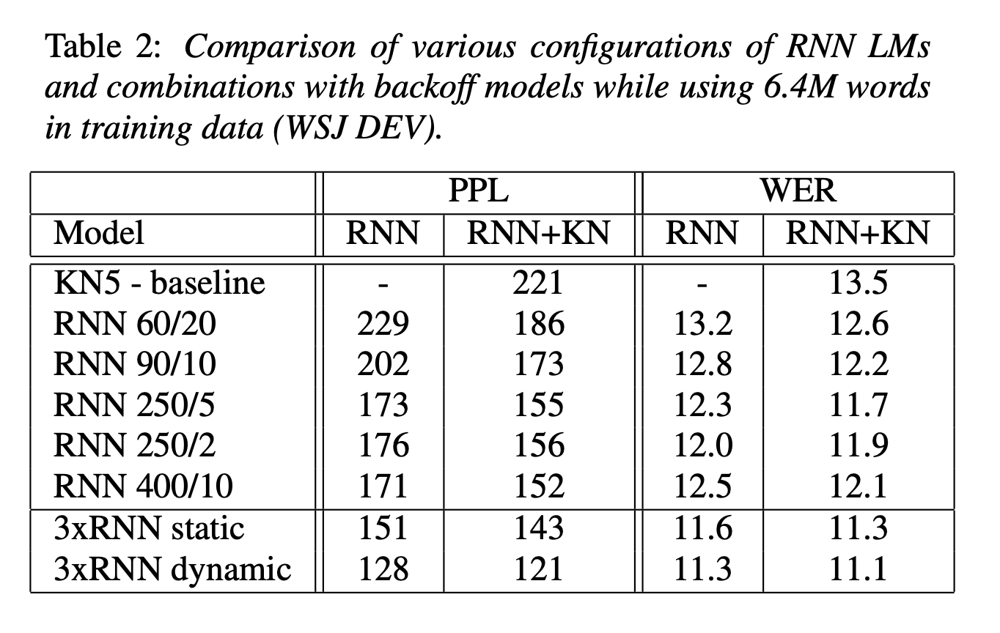
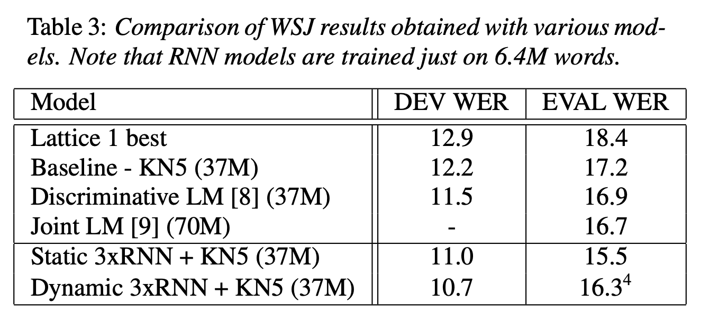
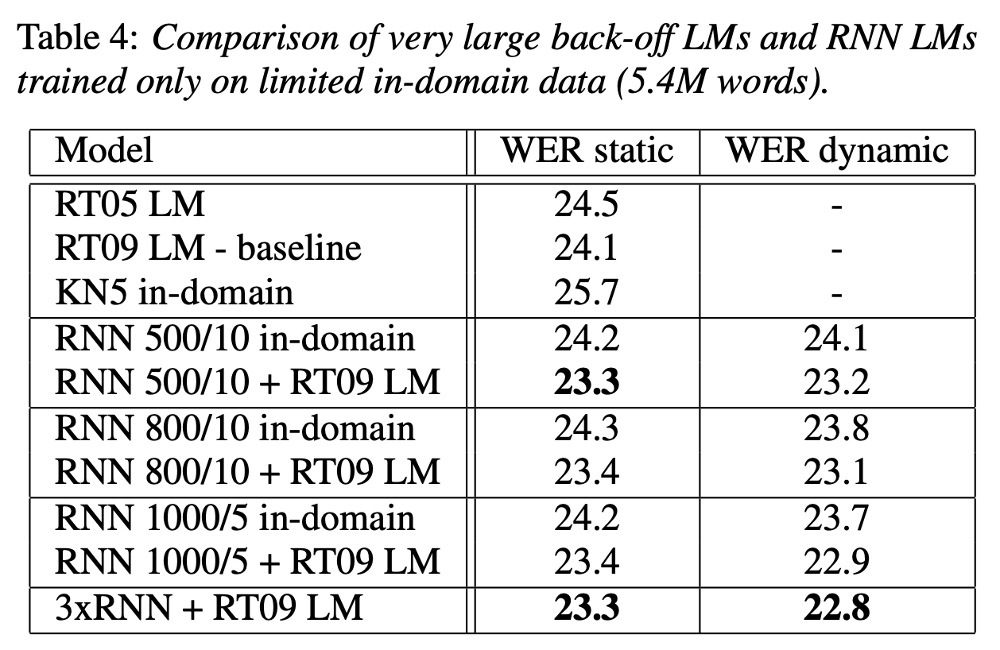

논문 링크: https://www.fit.vut.cz/research/group/speech/public/publi/2010/mikolov_interspeech2010_IS100722.pdf

## Abstract
- SOTA backoff 언어 모델 대비 혼란도(perplexity)를 약 50% 줄일 수 있다.
- 음성 인식 실험에서 Wall Street Journal task에서 동일 데이터일 때 오류율 18% 감소, NIST RT05 task에서 더 적은 데이터로 오류율 5% 감소했다.
- 모델 훈련시 높은 계산 복잡도를 가진다는 점을 제외하면, RNN은 표준 n-gram 기술에 비해 우수하다.
## 1. Introduction
### Sequential data Prediction(순차적 데이터 예측)
- 통계적 언어 모델링의 목표는 주어진 맥락에서 텍스트 데이터에서 다음 단어를 예측하는 것
- 따라서 언어 모델을 구성할 때 순차적 데이터 예측 문제를 다루고 있다.
### based on n-gram statistics (n-gram 통계 기반)
- ngram 통계를 기반으로 하는 가장 널리 사용되는 일반 모델조차도 언어는 문장을 형성하는 원자 기호(단어)의 시퀀스로 구성되며 문장 기호의 끝이 중요하고 매우 특별한 역할을 한다고 가정
- 간단한 n-gram 모델에 비해 언어 모델링에 중요한 진전이 있었는지는 의문
### Cache Models
- 최근에 등장한 단어들을 저장하고, 이 단어들이 다시 등장할 확률을 높이는 방식
- 언어의 **지역적 일관성**(local coherence)을 활용하는 방법 (가정: 특정 문맥에서 최근에 사용된 단어가 다시 나타날 가능성이 높다) 
- e.g) 이전 문장이 "The cat sat on the" 라면, 단어 "cat"이 최근 사용되었으므로 다음 문장에서 "cat"이 다시 등장할 확률이 높다.
### Class-Based Models
- 단어들을 클래스로 그룹화하여 모델의 복잡성을 줄이는 방법
- 각 단어는 하나 이상의 클래스에 속할 수 있으며, 모델은 단어 자체보다는 클래스 간의 전환 확률을 학습
- 클래스 정보를 사용하여 단어 간의 관계를 더 잘 이해하고 예측하여 모델 일반화 능력을 향상 (특히 데이터가 적을 때 유용)
- e.g) “dog”, “cat”, "mouse" 들은 모두 “animal” 클래스에 속한다.
### advanced language modeling techniques (고급 언어 모델링 기술)
- 연구를 통해 얻은 모델은 복잡한 경향이 있으며 매우 제한된 양의 교육 데이터를 기반으로 하는 시스템에서만 잘 작동하는 경우가 많다.
- 실제로 제안된 고급 언어 모델링 기술의 대부분은 단순한 기준에 비해 아주 작은 개선만을 제공하며 실제로는 거의 사용되지 않는다.

## 2. Model description
### Background
- Bengio에 의해 제안된 통계적 언어 모델링에 인공 신경망을 사용하는 접근 방식은 매우 성공적
- 그러나 feedforward network가 훈련 전에 임시로 지정해야 하는 고정 길이 context를 사용해야 한다는 결함이 있다.
- 일반적으로 이는 신경망이 다음 단어를 예측할 때 앞의 단어 5~10개만 본다는 것을 의미
- -> 더 긴 context를 활용하면 큰 성공을 거둘 수 있을 것 (캐시 모델은 신경망 모델에 보완적인 정보를 제공하기 때문에 이러한 임의 길이의 context에 대해 시간 정보를 인코딩하는 모델을 생각하는 것이 당연하다)
- -> 순환 신경망은 제한된 크기의 컨텍스트를 사용하지 않으며, 반복 연결을 사용하면 정보가 오랜 시간 동안 네트워크 내에서 순환할 수 있다.
### Simple Recurrent Neural Network (Elman network) Architecture
- 입력층 $x(t)$, 은닉층 $s(t)$, 출력층 $y(t)$
$$x(t) = w(t) + s(t − 1)$$
$$ s_j(t) = f \left(\sum_i x_i(t)u_{ji} \right) $$
$$ y_k(t) = g \left(\sum_j s_j(t)v_{k} \right) $$
- 시그모이드 활성화 함수
$$ f(z) = \frac{1}{1 + e^{−z}} $$
- 소프트맥스 함수
$$ g(z_m) = \frac{e^{z_m}}{\sum_k e^{z_k}} $$
- 네트워크는 시간 t에서 입력층 $x(t)$, 은닉층 $s(t)$, 출력층 $y(t)$로 구성
- 입력 벡터 $x(t)$는 현재 단어를 나타내는 벡터 $w$와 시간 $t − 1$에서 컨텍스트 레이어 s의 뉴런 출력을 연결하여 형성
- 초기화: $s(0)$을 0.1과 같은 작은 값의 벡터로 설정할 수 있다. (대량의 데이터를 처리할 때는 초기화가 중요하지 않으며, 다음 시간 단계에서 $s(t+ 1)$은 $s(t)$의 복사본)
- 입력 벡터 $x(t)$는 원-핫-인코딩 및 이전 컨텍스트 레이어를 사용하여 인코딩된 시간 $t$의 단어를 나타냄. 벡터 $x$의 크기는 어휘의 크기 V (this can be in practice 30 000 − 200 000)에 컨텍스트 레이어의 크기를 더한 것과 같다.
- 컨텍스트(히든) 레이어의 크기는 일반적으로 30 - 500 히든 유닛이다. 히든 레이어의 크기는 훈련 데이터의 양을 반영해야함.
- 가중치는 작은 값(평균이 0이고 분산이 0.1인 무작위 가우스 노이즈)으로 초기화
- 네트워크를 훈련시키기 위해  확률적 경사 하강법을 사용하는 표준 역전파 알고리즘을 사용 
- 시작 학습률 α = 0.1, 유의미한 개선이 관찰되지 않으면 학습률 α는 새로운 신기원이 시작될 때마다 절반으로 줄어들고 다시 큰 개선이 없으면 훈련이 종료 (일반적으로 10~20 에포크 이후 수렴)
- 출력 레이어 y(t)는 이전 단어 w(t)와 컨텍스트 s(t − 1)가 주어지면 다음 단어의 확률 분포를 나타냄. Softmax는 이 확률 분포가 유효한지 확인. (임의의 단어 m에 대해 $y_m(t) > 0$ 이고 $\sum_k y_k(t) = 1$)
- 각 훈련 단계에서 교차 엔트로피 기준에 따라 오류 벡터가 계산되고 표준 역전파 알고리즘으로 가중치가 업데이트된다.
$$ error(t) = desired(t) − y(t) $$
- desired는 특정 컨텍스트에서 예측되어야 하는 단어를 나타내는 원-핫-인코딩을 사용하는 벡터이고 $y(t)$는 네트워크의 실제 출력
### dynamic model
- 통계 언어 모델링의 훈련 단계와 테스트 단계는 일반적으로 테스트 데이터가 처리될 때 모델이 업데이트되지 않는다는 점에서 다르다. 따라서 테스트 세트에 새로운 사람 이름이 반복적으로 나타나면 알려진 단어로 구성되어 있어도 매우 작은 확률을 반복적으로 얻게 된다.
- 이러한 장기 메모리는 컨텍스트 단위의 활성화(매우 빠르게 변경됨)에 상주해서는 안 되며 오히려 시냅스 자체에 상주해야 한다고 가정할 수 있다. 즉, 네트워크는 테스트 단계 중에도 훈련을 계속해야 한다. 이러한 모델을 동적 모델이라고 부른다.
- 동적 모델의 경우 고정 학습률 α = 0.1을 사용
- 훈련 단계에서는 모든 데이터가 여러 세대에 걸쳐 네트워크에 제공되지만 동적 모델은 테스트 데이터를 처리할 때 한 번만 업데이트
- 이러한 수정은 신경망이 연속 공간에서 학습한다는 차이점을 제외하면 백오프 모델의 캐시 기술과 매우 유사하므로 '개'와 '고양이'가 관련되어 있으면 테스트 데이터에서 '개'가 자주 발생하는 경우에도 '고양이'일 확률의 증가가 트리거된다.
### BPTT 
- 그러나 음성인식 실험에서 역사는 인식자가 제시한 가설로 표현되며, 인식 오류를 포함하고 있다. 이로 인해 일반적으로 ASR의 캐시 n-gram 모델 성능이 저하된다.
- 여기에 설명된 훈련 알고리즘은 $τ = 1$인 시간에 따른 잘린 역전파라고도 한다. 네트워크의 가중치는 현재 시간 단계에 대해서만 계산된 오류 벡터를 기반으로 업데이트되므로 최적이 아니다. 이러한 단순화를 극복하기 위해 BPTT(backpropagation through time) 알고리즘이 일반적으로 사용된다.
- RNN LM: 컨텍스트(히든) 레이어의 크기만 선택 / Bengio 및 Schwenk의 피드포워드 네트워크: 단어를 저차원 공간에 투영하는 레이어의 크기, 히든 레이어의 크기 및 컨텍스트 길이를 조정
### 2.1 Optimization
- 성능을 향상시키기 위해 (훈련 텍스트에서) 임계값보다 적게 발생하는 모든 단어를 특별한 희귀 토큰으로 병합
- 단어 확률은 $C_{rare}$가 임계값보다 적게 발생하는 어휘의 단어 수로 계산된다.

$$
P(w_{i}(t+1)|w_{c}(t), s(t-1)) = 
\begin{cases} 
\frac{y_{rare}(t)}{c_{rare}}, & \text{if } w_{i}(t+1) \text{ is rare} \\
y_{i}(t), & \text{otherwise}
\end{cases}
$$

- 따라서 모든 희귀 단어는 동등하게 취급되어 확률은 그들 사이에 균일하게 분포됨.

## 3. WSJ experiments

- 훈련 데이터가 증가함에 따라 개선 효과도 계속 커지고 있다(= 더 많은 데이터를 사용하는 것만으로도 더 큰 개선 효과를 얻을 수 있다)
- WER (단어 오류율)은 modified Kneser-Ney smoothing을 사용하여 5-gram에 대해 3개의 동적 RNN LM 혼합을 사용할 때 약 18% 감소 (13.5 -> 11.1)
- perplexity (복잡성)은 KN 5-gram과 3개의 동적 RNN LM 혼합을 비교할 때 거의 50%로 감소 (221->121)
- 실제로 테스트 데이터를 처리할 때 더 큰 학습 속도(α = 0.3)와 정적 및 동적 RNN LM을 혼합하니 perplexity가 112까지도 감소했다.

- 이전 실험의 모든 LM은 6.4M 단어로만 훈련
- Xu \[8\] 및 Filimonov \[9\] 와의 비교를 제공하기 위해 37M 단어 기반 백오프 모델을 사용
- RNN 기반 모델은 5배 더 많은 데이터에 대해 훈련된 백오프 모델과 비교하여 약 12%까지 WER을 줄일 수 있다.
## 4. NIST RT05 experiments

- 이전 실험은 최신 기술과 거리가 멀고 그걸 개선하는 것이 잘 조정된 시스템을 개선하는 것보다 쉽다는 비판이 있을 것. 또한 기준 백오프 모델을 훈련하는 데 사용되는 37M 또는 70M 단어가 작업에 가능한 것보다 훨씬 작다.
- 그래서 최첨단 시스템에서 의미 있는 개선이 가능하다는 것을 보여주겠다.
- RNN LM을 학습하기 위해 회의 녹취록과 스위치보드 코퍼스로 구성된 도메인 데이터에서 총 5.4M 단어를 선택
-  RNN LM은 백오프 모델보다 적은 데이터로 훈련되었음에도 더 나은 성능을 보였다.
## 5. Conclusion and future work
- 언어 모델링이 n-gram 수를 세는 것에 불과하며 결과를 개선하는 유일한 합리적인 방법은 새로운 훈련 데이터를 획득하는 것이라는 통념을 깨뜨렸다.
- 온라인 학습은 cache-like 정보와 trigger-like 정보를 얻는 자연스러운 방법을 제공하므로 추가 연구가 필요하다.
- 실제로 언어를 배울 수 있는 모델을 구축하려면 새로운 정보를 얻을 수 있는 온라인 학습이 중요하다.
- 순환 신경망 학습을 위한 BPTT(backpropagation through time) 알고리즘에 대한 연구를 통해 추가적인 개선이 이루어질 수 있다. 
- 작업에서 작업이나 언어별 가정을 하지 않았기 때문에 기계 번역이나 OCR과 같은 백오프 언어 모델을 사용하는 모든 종류의 애플리케이션에서 RNN 기반 모델을 거의 쉽게 사용할 수 있다.

### 요약 및 후기
- 첫 논문 읽기였는데, 아직은 논문만 읽어서는 잘 모르겠는 부분도 있어 이를 학습하고 추가 정리해야겠다.
- 논문은 해당 시점의 배경을 반영하는 것 같다고 느껴진다. 그 당시 어떤 문제가 있었으며 그걸 어떻게 해결하는 지를 설명한다. 또한 평가지표를 통해 개선을 수치적으로 평가한다.
- 모델에 대한 실험적인 내용을 구체적인 수치로 설명하며 다른 연구자들에게 가이드를 제공하는 느낌이다.
- 단순히 모델에 대해 정리된 글을 읽는 것보다 해당 모델에 대한 원본 논문을 읽는다면 접근 방법이나 파라미터 등에 대한 아이디어를 얻을 수 있는 것 같다.