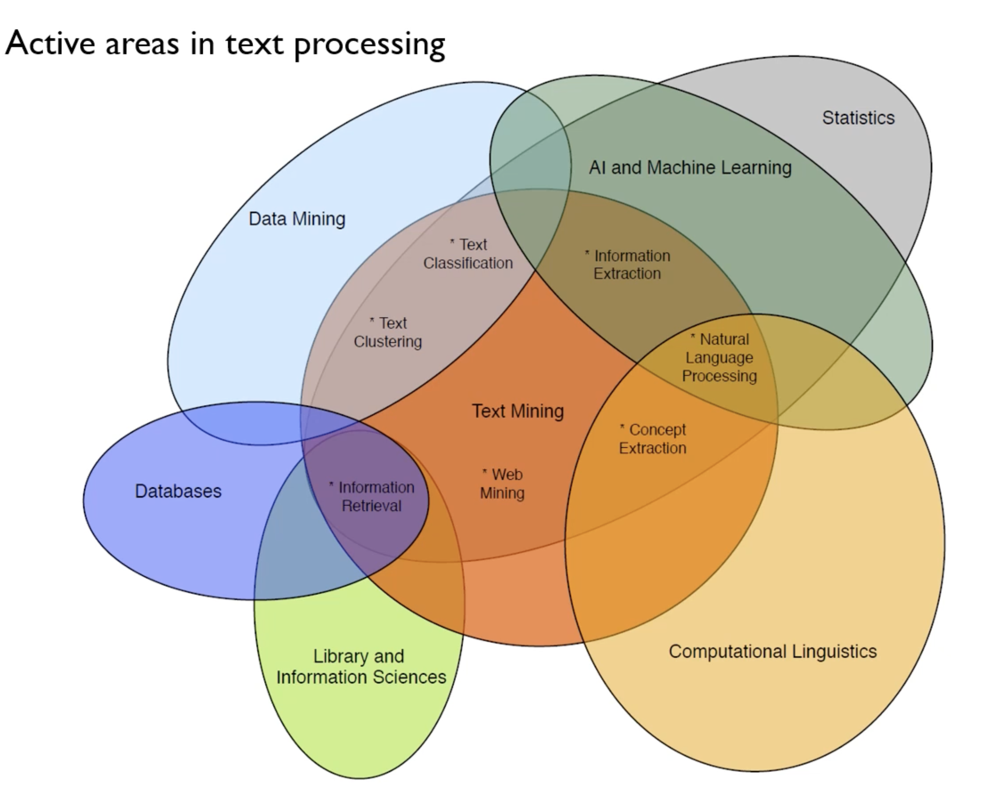

# Text Mining Overview
## Text Analytics: Background
- 80% 이상의 새로운 데이터는 비정형 데이터, 그 중 많은 비중을 차지하는 것이 텍스트 데이터이다. 
- 검색어에 알맞는 문서를 반환해주는 검색 엔진으로는 부족하며, 새로운 지식을 발견하는 것이 요구된다.
## Example: AI papers in arXiv
- 인공지능에 관련한 논문의 수가 기하급수적으로 증가 중 (2018년 기준 약 3000편 이상)
- 텍스트 마이닝을 통한 논문의 단어 빈도 분석
	1. Machine learning eclipses knowledge-based reasoning
	2. The Neural-Network Boom
	3. The rise of reinforcement learning

## Text Analytics: Definition
- 비정형 텍스트 데이터를 분석하여 의미있는 지식이나 지혜를 뽑아내는 것이 목적
- **For Unstructured Text Data -> Using Various Analytical Methods -> Extract Meaningful Information and Knowledge**
## Text Analytics: Applications
- Information Abstraction/Summarization/Visualization (정보 추출/요약/시각화)
	- ex) 대통령 연설문 워드 클라우드 시각화, 중앙 은행 연설문 나라별 벡터 유사도 계산, 중앙 은행의 연도별 연설문 주요 키워드
	- ex) 데이터 전처리 및 벡터화 -> 특이 소비자 의견 탐지 -> 키워드 및 관계도 분석
- Document Clustering (문서 클러스터링)
	- ex) 특허 검색 시스템 (새로 출헌된 특허가 기존 특허와 얼마나 유사성을 가지고 있는지 판단, 과거 특허 Map을 형성하고 새로운 특허가 이미 충분히 밀집된 지역에 매핑된다면 참신하거나 새로운 특허일 확률이 낮음)
- Topic Extraction (문서를 분석하여 코퍼스에 잠재된 토픽 찾기)
	- ex) Science 저널에 존재하는 17,000건의 논문에 대해 100개의 Topic으로 Modeling (Topic Naming은 지금까지는 도메인 전문가/데이터 분석가에 의해 수작업으로...)
	- ex) 토픽 간 관계(유사도) 분석
- Document Categorization/Classification (문서 분류)
	- ex) Spam mail filtering
	- ex) Sport player evaluation (Term -> STAT -> Best Player Prediction)
	- ex) Sentiment Analysis 
- Recommendation (추천)
	- ex) Named entity recognition/extraction (NEE/NER)을 활용한 검색엔진 
- Improve forecasting accuracy combined with structed data (정형 데이터와 결합하여 예측 정확도 향상)
	- SNS 게시글 기반 박스 오피스 스코어 예측
	- 금융 기업에 대한 조기 경고 모델
- Natural Language Understanding: Question Answering
	- ex) IBM Watson
	- ex) ChatBot (Dialogue system)
## Text Analytics: Challenges
- High number of possible "dimensions" (고차원, 단어 수가 너무 많음)
- Complex and subtle relationship between concepts in texts (텍스트 내의 개념들 간의 복잡하고 미묘한 관계)
- Ambiguity and context sensitivity (중의성 및 문맥 민감성)
- Structure of text data
## Text Analytics: Text Structures 
### How Unstructured is "Unstructured"?
- Weakly structured
	- 논문, 뉴스 등
- Semi-structured
	- E-mail, HTML/XML 등
### Why is Text Mining Hard?
Language itself is ambigious (언어 자체의 중의성, 모호성)
- Contexts is needed to clarify
- Same word with different meanings, different words with same meaning
- Misspellings, abbreviations, etc.
## Text Analytics:Areas

## Types of Text Analytics
### Document Classification
문서 분류 (라벨O)
### Document Clustering
문서 클러스터링 (라벨X)
### Concept Extraction
단어/구 유사성 추출
### Search and Information Retrieval (IR)
### Information Extraction (IE)
### Web Mining
### Natural Language Processing(NLP)
- 저수준 언어 프로세싱 
- 자연어 전처리: 어휘 분석, 구문 분석
## A Simplified Process of Text Analytics
1. Define what to mind & Collect text data
2. Process & Transform the data
	- From unstructured to structured (가변 길이의 문서를 고정 길이의 벡터로 표현)
3. Select/Extract features
4. Algorithm Learning & Evaluation
	- 1(비구조화 데이터 수집) -> 2,3을 통해 데이터 구조화 -> 4(머신러닝 모델에 구조화된 데이터 적용)

## 강의 요약
- Text Analytics에 대한 전반적인 개요 강의이다.
- Text Analytics가 어떤 분야에 어떻게 사용되며 어떤 어려움이 있고, 어떤 과정을 통해 이루어지는지 설명한다. 
- 주로 어떻게 사용되는 지에 대한 applications 예시 위주의 설명이며, 앞으로 어떤 내용을 배울 지 감을 잡는 정도로 이해하면 될 듯하다.