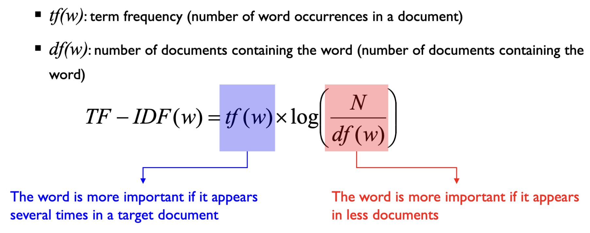

# TA Process 1: Collection & Preprocessing
## Decide What to Mine
- 데이터셋 수집 혹은 수집된 데이터셋 선택
## Text Preprocessing Level 0: Text
- Remove unnecessary information from the collected data
- Do not remove **meta-data** (Newspapaer article: author, date, category, language, etc), which contains significant information on the text
- Meta-data can be used for further analysis
	- Target class of a document
	- Time series analysis
## Text Preprocessing Level 1: Sentence
- 가장 상위 개념 문서의 바로 하위 개념은 문단(여러 문장의 집합체)이나 문단 자체를 분석하는 일은 많지 않음. 즉 문장 단위의 분석은 텍스트 분석에서 (거의) 가장 상위 개념임
- For many downstream analysis tasks
	- POS-Tagger(형태소 분석): 문장 내 각 태그들의 발생 확률 최대화
	- Summarization(요약): 어떤 문장이 가장 중요한 문장인지 선택
- Sentence Splitting
	- 문장 부호 없이 문장 분리는 꽤나 어려운 task
## Text Preprocessing Level 2: Token
- Extracting meaningful tokens 가장 작은 의미있는 단위 
	- ex) word,number,space, etc
- 쉽지 않은 task임 
	- ex) John's sick, C++, A/C 같은 단어들을 어떻게 구분할 것인가
	- ex) 띄어쓰기가 없는 중국어
### Power distribution in word frequencies
- 빈번하게 사용되는 단어일 수록 중요한 것은 아니다 (ex 관사 등은 큰 의미가 없고 많이 쓰임)
### Stop-words(불용어)
- 문법적 기능을 수행하나 의미를 갖고 있지는 않음 -> 자연어처리 관점에서는 제거함
### Stemming(어간 추출)
- **base form(normalized form)**
- ex) Innovations, Innovate , Innovative -> Innovat
- 사전에 존재하지 않을 수 있으나 결과물 갯수가 훨씬 적다 (차원의 숙소 관점에서 더 효율적)
### Lemmatization(표제어 추출)
- **root of a word**
- ex) Innovation, Innovate , Innovative -> Inovation, Innovate, Innovative
- 결과물 갯수가 더 많으나 품사를 보존한다.
# TM Process 2: Transformation
## Text Transformation
### Document representation
문서를 어떻게 하면 연속형의 숫자로 표현할 것인가 (text를 D 차원의 실수 공간으로 표현)
- Bag-of-words: 각 문장에서 단어의 등장 횟수를 세어 벡터로 표현 (단어 모음)
- Word Weighting: 특정 단어가 어떤 문서에서 얼마나 중요한지 가중치로 표현
	- TF-IDF (Term frequency and inverse document frequency)
	  단어 W가 문서 D에서는 자주 등장하지만 Corpus에서는 적게 등장해야 TF-IDF가 커지고, 즉 단어 W가 문서 D를 얼마나 특징지어줄 수 있냐이다. 
	
### One-hot-vector representation
- 전체 단어의 갯수만큼의 차원을 가짐
- ex) Wcat  = [1,0,0, ... ,0] , Wzebra = [0,1,0, ... ,0]
- 두 단어의 유사성이 보존될 수 없다. (모든 벡터들 사이의 내적이 0이기 때문)
### Word vectors: distributed representation (분산 표상)
- n 차원의 실수 공간에 매핑해주는 방법론을 개발해보자 (n < v, v: vocab size)
- ex) Wcat  = (0.2, -0.4 ,0.7, ... ) , Wzebra = (0.0, 0.6, -0.1,  ... )
- Semantic relationship between words can be preserved (단어 간 의미적 관계를 보존)
### Pre-trained Models
- Word Models: Word2vec, GloVe, fastText
- Language Models: ELMo, GPT, BERT
# TM Process 3: Dimensionality Reduction
## Feature Selection/Extraction
### Feature subset selection
- 중요도를 판단하여 최적의 변수 집합 선택 (선택적 사용)
- Scoring methods for individual feature (for supervised learning tasks)
	- Information gain, Cross- entropy, ...
### Feature subset extraction
d > d` (특성 추출로 차원이 축소되어야 함)
- 원본 데이터가 가진 정보를 최대한 보존하면서 훨씬 더 적은 데이터셋을 생성
- LSA (Latent Semantic Analysis, 잠재 의미 분석)
	- ex) 연구 초록에서 긍정/부정 키워드 분석
### SVD in Text Mining
- 전체 r차원을 사용하지 않고 r보다 작은 k개의 차원을 가지고 데이터를 재구축(reconstruction)할 수 있다.
- 문서 또는 단어를 축약하는데 사용
### Topic Modeling as a Feature Extractor
- 토픽 모델링: unsupervised 관점에서 corpus를 관통하는 주요 주제를 판별하여 문서별로 주제의 비중(**Per-document topic proportion**)과 각 주제별로 각 단어들이 얼마의 발생빈도를 가지는가(**Per-topic word distribution**) 두가지 Output
- feature extractor 관점에서는 전자의 output(문서별 주제의 비중) 사용 -> document는 k 차원(k개의 topic)을 갖는 연속형 벡터로서 표현할 수 있다. 
### Document to vector (Doc2Vec)
- A natural extension of word2vec
- Use a distributed representation for each document
- 문서와 단어가 동일한 차원의 공간 상에 표현될 수 있는 학습 기법
# TM Process 4: Learning & Evaluation
## Similarity Between Documents 
- Document similarity
	- Use **cosine similarity** rather than Euclidean distance
	- 단어의 사용 빈도나 분포 관점에서 볼때 코사인 유사도가 더 유사도를 잘 나타냄
## Learning Task 1: Classification
- Document categoraization (classification)
- Spam filtering
- Sentiment Analysis
## Learning Task 2: Clustering
- Document Clustering
	- 주요 topic 판단
	- topic간 관계
	- 문서 이해
-  Visualization
	- keyword간 관계 시각화
	- 저널/토픽 카테고리간 유사성 시각화
## Learning Task3: Information Extraction/Retrieval
- Information extraction/retrieval
	- ex) Question Answering (SQuAD 2.0)
- Topic Modeling
- Latent Dirichlet Allocation (LDA)
