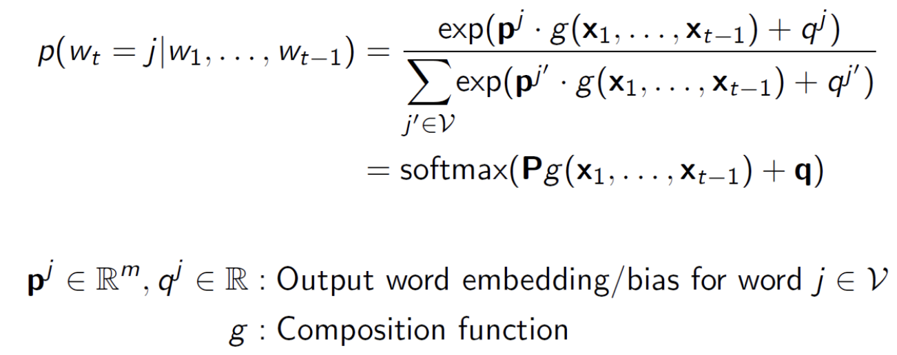
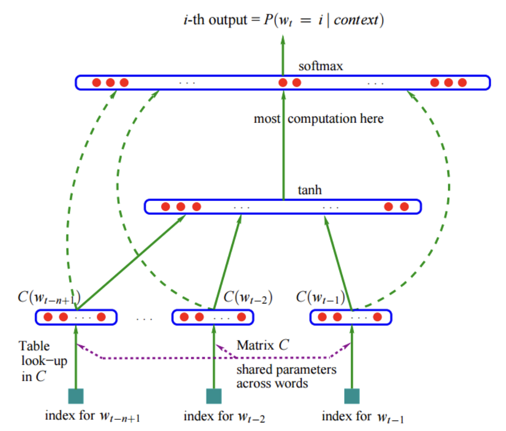

# Word-level: NNLM
## Distributed Representation: Word Embedding
### Word Embedding
어떤 단어를 **의미론적으로 유사한 단어는 서로 가까운 공간상에 위치하도록** 특정 공간의 vector space로 매핑하는 것
### Word vectors: one-hot vector
- 가장 단순하고 직관적인 표현
- 특정 단어의 인덱스에 대해 그 단어가 맞으면 1, 아니면 0
  $w^{at} = [0,0,1, \dots , 0]$,  $w^{zebra} = [0,0,0,\dots, 1]$
- 단어 사이의 유사도가 보존되지 않는다.
  $(w^{hotel})^Tw^{motel} = (w^{hotel})^Tw^{cat}=0$
### Word vectors: distributed representation
- 단어들을 임의의 차원을 갖는 벡터로 바꾸는 parameterized function(하나의 표현식에 대해 다른 parameter를 사용하여 다시 표현하는 과정)을 찾는다.  
  $W: words \rightarrow R^n$ , $(n << |V|)$
- 의미론적인 차이가 단어의 벡터 차이에 보존이 된다.
	- $v(king) - v(queen) \simeq v(man) - v(woman)$
	- $v(walking) - v(walked) \simeq v(swimming) - v(swam)$  
## Neural Network Language Model (NNLM)
### Purpose
distributed representation을 통해 one-hot-encoding의 **curse of dimensionality(차원의 저주)** 해결
- 각 단어들을 분산된 word feature vector로 표현
- 단어 sequences의 결합 확률 분포를 통해 해당하는 단어들의 조합이 발생할 확률을 계산
- 1. 어떤 feature vector가 좋은 것인가 2. 단어 sequences의 probability가 높게 / 두 가지를 학습하겠다.
### Why it works?
우리가 `dog and cat`이 (의미적으로나 종합적으로) 비슷한 역할을 한다는 것과 `(the,a), (bedroom, room), (is, was), (running,walking)`에 대한 유사성을 안다면 자연스럽게 일반화할 수 있다.  

e.g.) The cat is walking in the bedroom 이 하나의 문장을 통해
- `A` `dog` `was` `running` in `a` `room`
- The cat is `running` in `a` `room`
- `A` `dog` is walking in `a` bedroom
- The `dog` `was` walking in the `room`
등을 전부 generation 할 수 있다.
## Comparison with Count-based Language Models
### Count-based Language Models
- Chain rule에 의해 $w_1$ 부터 $w_t$ 까지 발생할 결합확률분포는 $P(w_1)P(w_2|w_1)P(w_3|w_1w_2) \dots$
- 100번째 단어를 만드는 Language Model을 사용하려면 99개의 단어를 모두 본 다음 100번째 단어를 봐야하는데, 99개 단어 sequence가 같은 조합을 찾기가 거의 불가능함
- **Markov assumption**: 모두 보는 것이 아닌 기존의 n-gram 만큼만 보고 예측하자
## NNLM
- 단어는 특정 공간 $R^n$상의 dense vector이다. $(n << |V|)$
- $w_t \in R^{|V|}$ : **One-hot representation** of word $\in V$ at time $t$
- $\Rightarrow x_t = Xw_t$ : **Word embedding** ($X \in R^{n\times |V|}, n < |V|$)
  (X가 가져올 look-up table이고 embedding matrix이다.)
- 다음 단어를 예측하는 neural network을 학습
  
   ($w_1$ 부터 $w_t-1$ 가 주어지면 $w_t$가 과연 $j$일지를 찾고자 하는 것)
### NNLM Architecture

- shared parameters across words: look-up table (word embedding이 저장되어 있는 table)은 전부 다 공용으로 사용한다. (각 Matrix $C(w_i)$들이 같은 table에서 왔다는 뜻)
- 초록색의 실선은 모델이 그대로 연결되어있는 부분, 점선은 Optional (output을 만들 때 hidden node를 뛰어넘고 input->output 연결하는 skip connection이 존재할 수도 있다)
### Learning NNLM
- 좋은 모델 $f$(전체 단어가 아닌 window에 해당하는)를 찾는 것  
  e.g.) 5-gram: 앞선 4개에 단어에 대해 5번째 단어를 예측하는 상황에서 확률이 극대화되는 함수 또는 모델  
- 제약 조건
	1. 어떤 조건에서도 이후 단어들이 생성될 확률의 총합은 1
	2. $f\geq0$ (각 단어가 생성될 확률은 0보다 크거나 같아야 함)
#### Decompose the function $f$
$f(w_t, \dots w_{t-n+1} = \hat{P}(w_t|w_1^{t-1})$
- A mapping C (look-up table)
- The probability function over words, expressed with C
$f(i, w_t, \dots, w_{t-n+1} = g(i, C(w_t), \dots, C(w_1^{t-1}))$
- The function $f$ is a composition of these two mappings (C and g), with **C being shared across all the words in the context**
#### $y = b + Wx+ U \cdot tanh(d + Hx)$ 
- $Wx$는 optional, $U \cdot tanh(d + Hx)$ 는 필수적인 부분
- $x$는 word features
- $h$는 hidden units 개수
#### Stochastic gradient ascent

---
# 요약
- Word Embedding
  단어를 의미가 비슷한 단어끼리 서로 가까운 공간에 위치하도록 매핑하는 것
- Word Vectors
	- one-hot vector
		- 특정 단어의 인덱스에 대해 그 단어가 맞으면 1, 아니면 0
		- 단어 사이의 유사도가 보존되지 않는다. (내적이 무조건 0)
	- distributed representation
		- 단어들을 임의의 차원을 갖는 벡터로 바꾸는 parameterized function을 찾는다.
		-  단어 사이의 유사도가 보존된다.
- Neural Network Language Model (NNLM)
	- Count-based Language Models
		- Chain rule에 의해 $w_1$ 부터 $w_t$ 까지 발생할 결합확률분포를 계산
		- 모든 이전 단어들을 보기 힘드니 마르코프 가정을 통해 n개만 보자 
	- NNLM
		- look-up table에서 word embedding을 가져와 다음 단어를 예측하는 neural network을 학습한다.
		- 어떤 조건에서도 이후 단어들이 생성될 확률의 총합은 1이고, 각 단어의 확률은 0 이상이다는 제약조건을 가진다.