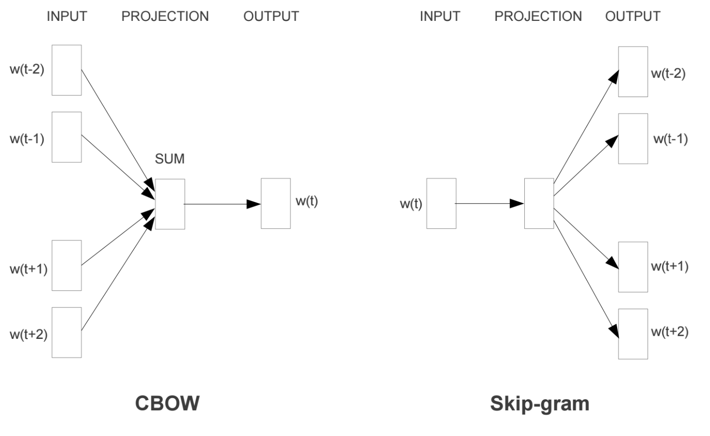

# Word-level: Word2Vec
## Two Architectures
- Continuous bag-of-words (CBOW) : 주변 단어들로 한 단어를 예측   
- **Skip-gram** : 한 단어로 주변 단어들을 예측  
일반적으로 정보를 더 많이 받아 하나의 단어를 예측하는 CBOW가 더 성능이 좋을 것 같아 보이지만, Skip-gram이 더 좋은 성능을 보이는데, 이는 **Gradient flow** 관점에서 본다면 CBOW는 하나의 단어에서 주변 단어들의 gradient를 업데이트하는 반면 Skip-gram은 주변 단어들의 정보를 하나의 gradient를 업데이트하는데 사용하기 때문이다.

## Skip-gram
- linear한 단순한 neural network 구조로 Activation Function이 존재하지 않는다.
- Objective function
  log probability를 최대화 (k번째 단어가 주어졌을 때 k 앞뒤로 주어지는 단어들의 생성확률을 높이는 것)
## Model
### Skip-gram Model
- context words를 한꺼번에 예측하거나 따로 따로 예측해서 합치나 결과적으로 동일하기 때문에 각각 학습
- **given** center word -> **predict** context word
- $P(c|w)$ 최대화  
	- feature for word $w$: $x_w$  
	- classifier for word $c$: $v_c$  
- word vectors $x_w \in R^d$
### CBOW model
- 따로 따로 예측하는 것이 아닌 전체 단어를 가지고 중심 단어를 예측
- $P(w|C)$ 최대화
	- 소문자 c가 아닌 대문자 C인 이유는 전체의 context words의 조합으로서 나타나기 때문에
	- feature for word $C$: $h_c$  
	- classifier for word $w$: $v_w$  
- Continuous Bag Of Words $h_c = \displaystyle\sum_{c \in C} x_c$
### Another architecture explanation
- Hidden Layer **Linear** Neurons
- Hidden Layer Weight Matrix -> Word Vector Lookup Table!
---
## Gradient Ascent 유도
### For simplicity,  $p(w_{t+j}|w_t)$ 대신 다음 수식을 사용
$$ P(o|c) = \frac{exp(u_o^Tu_c)}{\sum_{w=1}^W exp(u_w^T v_c)}$$
- 여기서 o는 outside(output) 단어 id, c는 center 단어 id, u와 v는 o와 c의 outside와 center 벡터이다.
- 모든 단어는 two vectors를 가짐
	- **v** is a row of matrix $W$
	- **u** is a column of matrix $M’$
-  계산 효율을 위해 $W’ = W^T$ 로 정의하여 사용
### Learning parameters with Gradient Ascent
$$P(o|c) = \frac{exp(u_o^Tu_c)}{\sum_{w=1}^W exp(u_w^T v_c)}$$
Compute the gradient  
$$\frac{\partial}{\partial v_c} log \, p(o|c) = \frac{\partial}{\partial v_c} log \frac{exp(u_o^Tu_c)}{\sum_{w=1}^W exp(u_w^T v_c)}$$
  -  Learning parameters with Gradient Ascent
$$\frac{\partial}{\partial v_c} log \, p(o|c) = u_o - \sum_{w=1}^W P(w|c) \cdot u_w$$
  - Update the weight vector 
    $$v_c(t+1) = v_c(t) + \alpha \, (u_o - \sum_{w=1}^W P(w|c) \cdot u_w)$$
## Learning strategy
- Do not use all nearby words, but on per each training 
  (Neural Network에서 동시에 계산하나 따로 따로 계산하여 더하나 동일하다)
- the number of weights to be trained: 2 x V x N (Huge network!)
	- **Word pairs and phrases**: 빈번히 나오는 단어 쌍이나 구는 하나의 단어로 취급
	- **Subsampling frequents words**: 너무 많이 나오는 단어나 관사 등을 학습을 적게 시키기 
		- training examples 개수 줄이기 위함
		- The probability of word $w_i$, being removed
	- **Negative sampling**: 전체 모든 단어를 가지고 학습하지 말고 샘플링한 몇 개의 단어만 사용하여 가중치 업데이트

# 요약
- Word2Vec
	- CBOW
		- 주변 단어들로 한 단어를 예측
		- 하나의 단어에서 주변 단어들의 gradient를 업데이트
	- Skip-gram
		- 한 단어로 주변 단어들을 예측
		- 주변 단어들의 정보를 하나의 gradient를 업데이트하는데 사용
		- 일반적으로 CBOW보다 더 좋은 성능을 보임
	- Gradient Ascent
		- 목적함수를 단순화하여 식을 유도
	- Learning strategy
		- 하나의 쌍으로 각각 훈련하기
		- 빈번히 나오는 단어 쌍이나 구는 하나의 단어 취급
		- 너무 많이 나오는 단어, 관사 등은 학습을 적게 시키기
		- 모든 단어 대신 샘플링한 단어 몇개를 사용하여 학습하기