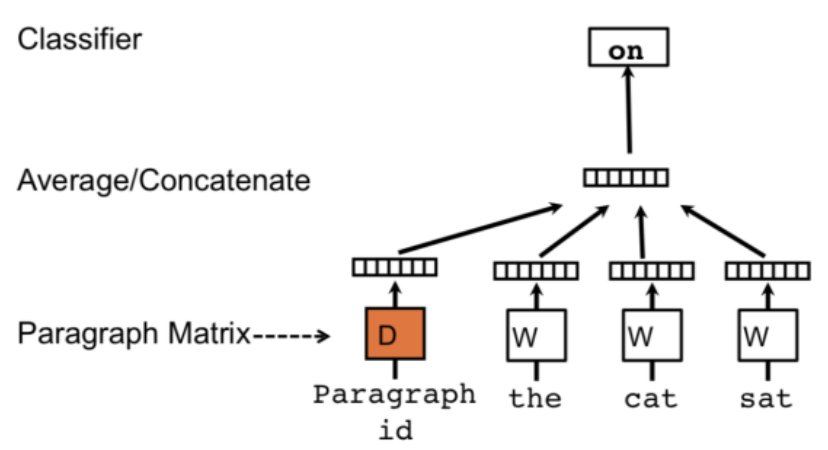
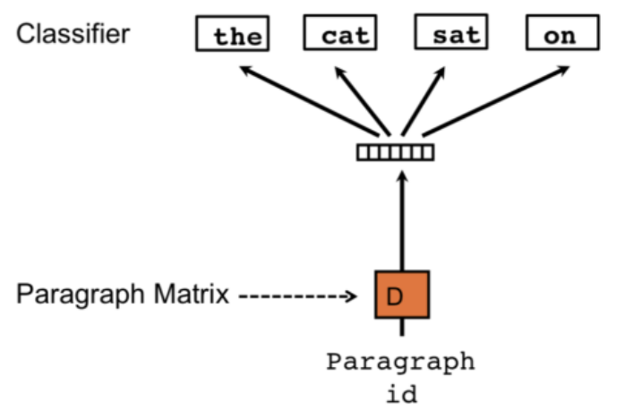
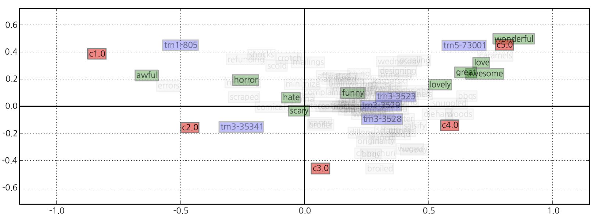

# Sentence/Paragraph/Document-level
## Document Embedding
### Paragraph Vector model: Distributed Memory (PV-DM) model
- Paragraph 마다 id를 가지고 있으며, 입력으로 단어와 함께 들어감
- 입력하는 단어의 개수는 window size에 해당하는 hyperparameter
- 다음 sequence에 해당하는 단어가 무엇일지 예측하는 모델
- Paragraph vectors는 해당하는 paragraph에 대응하는 단어를 가지고 modeling할 때는 항상 같은 값을 가진다.  
- Word vectors는 모든 paragraph에 공유된다. (A 문서의 cat과 B 문서의 cat이 같다.)

e.g.) The cat sat on the table 
1. Pid + the cat sat -> the
2. Pid + sat on the -> table
3. ...

### Paragraph Vector model: Distributed bag of Words (PV-DBOW)
- PV-DM과 달리 input에 word vectors를 필요로 하지 않는다
- force the model to predict words randomly sampled from the paragraph in the output (예측을 하는데 순서를 바꿔도 상관없음)
- PV-DM과 PV-DBOW를 combination(concatenation, averaging 등)하여 사용하는 것을 추천

--- 
# Let's Embed Everything!
## Supervised Paragraph Vector (SPV) for Class Embedding
- 녹색은 word vector, 보라색이 paragraph vector (review data), 빨간색은 평점에 대한 vector
- 평점 벡터와 가까울 수록 해당 평점을 가질 확률이 높음  

## Day Embedding in News corpus
- 뉴스 기사에서 Day, Section, IDX, TOPIC 태그 등을 임베딩
- 날짜를 임베딩하여 공간 상에 나타내면 특정 날짜와 비슷한 위치에 있는 날짜는 일어났던 사건이 비슷했구나를 유추해볼 수 있음
## System Call Trace Embedding for System Anomaly Detection
- System에 접속하여 수행한 행위를 코드화(로깅)한 데이터 셋
- 일반적인 사용자의 행동인지, 이상 행동인지 파악하는 것이 목적
- 특징: 시스템 로그 기록이 가변적임, 연속형 숫자가 아니기 때문에 숫자 자체가 의미를 갖지 않음
- 시스템 로그를 벡터화 시켜 특정 system call이 이상 행동인지 탐지하는 모델을 만들 수 있음

### Question
어떻게 하면 가변 길이의 System Trace를 고정 길이의 벡터로 변환할 수 있을까?
### Sequence Embedding based on Doc2Vec
Syscall2Vec: 하나의 System Call Trace를 Document로 취급하고, 개별 syscall을 word로 취급하여 임베딩 수행
## Live2Vec in afreecaTV
시청한 방송 하나를 word vector, 시청자의 시청 이력 Sequence를 Paragraph vector로 보고 시청한 방송을 예측하여 유사도 연산을 통해 다른 방송을 추천하는 시스템을 만들 수 있다.

--- 
# 요약
- Document Embedding
	- Paragraph Vector model: Distributed Memory (PV-DM)
		- Paragraph  id와 word vectors를 입력으로 다음 sequence 단어를 예측 
	- Paragraph Vector model: Distributed bag of Words (PV-DBOW)
		- 예측 Output의 단어 순서가 바꿔어도 상관없음
		- PV-DM과 PV-DBOW를 combination 하여 사용하는 것을 추천
- Embed Everything
	- Supervised Paragraph Vector (SPV) for Class Embedding
		- 리뷰 데이터에서 평점, 클래스 등을 임베딩하는 아이디어
	- Day Embedding in News corpus
		- 뉴스 기사에서 날짜 임베딩
	- System Call Trace Embedding
		- System Trace를 임베딩하여 시스템 이상행동 탐지
	- Live2Vec in afreecaTV
		- 라이브 방송을 임베딩하여 유사한 방송 추천 시스템