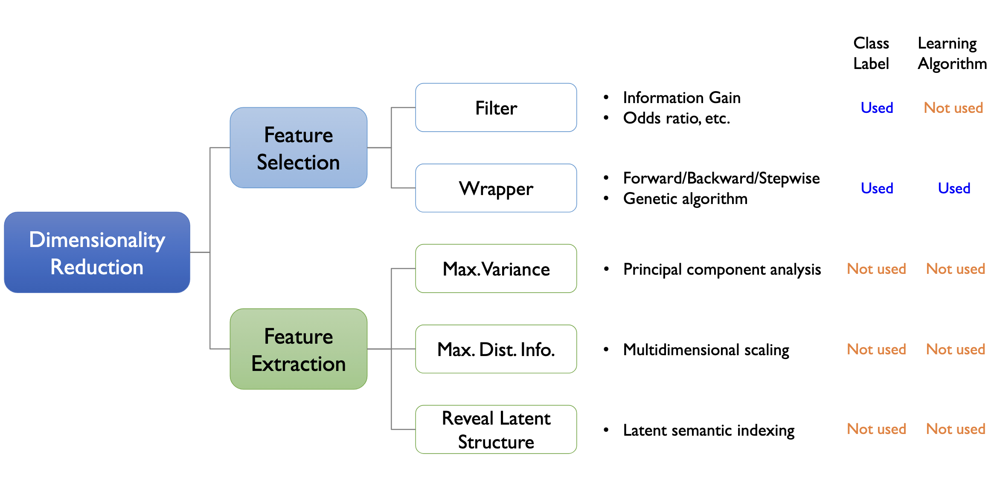
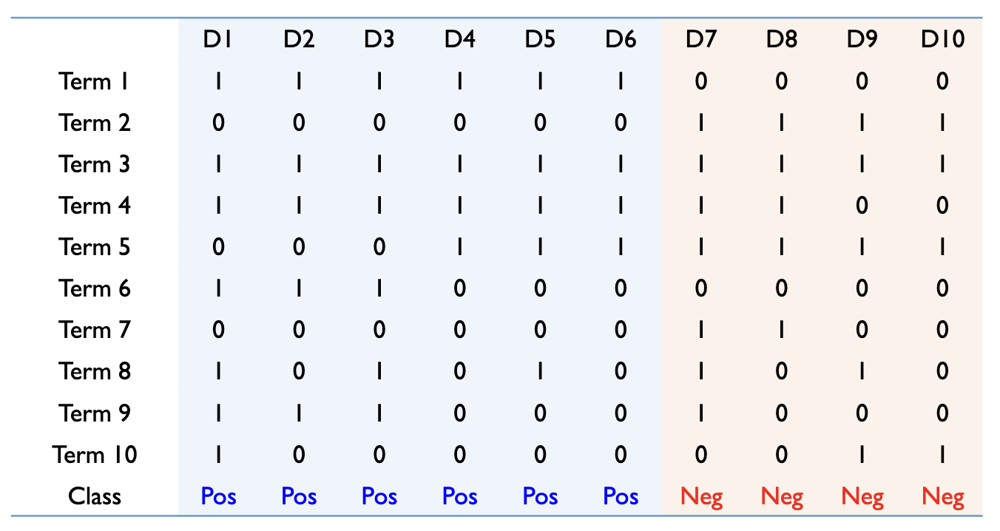

# Dimensionality Reduction  

### Common features of text data  
- 일반적으로 전부 Bag-of-words 방식으로 표현된 Document는 매우 많은 수의 terms(words)를 가지고 있음    
- 그중 일부만인 text mining task에 relevant하다  
- Problem 1: High dimensionality (N.terms >> N.documents)  
  통계학적인 관점에서 관측치의 수가 최소한 변수의 수보다는 많아야 다중 공산성과 같은 여러 통계적 가정을 만족할 가능성이 있음 -> 전통적인 통계적 방법론을 사용하기에 무리가 있다  
- Problem 2: Sparseness (Most elements in a term-document matrix are zero)  
  기껏해야 한 Paragraph는 100~200 단어로 구성이 된다면 영어가 13만 단어가 있으므로 나머지 단어가 전부 0이 되므로 저장과 처리 측면에서 효율성 문제가 발생  

### Why is dimensionality reduction necessary?
- 계산 효율성을 높임  
  - 시간, 저장 공간, 네트워크 리소스 절감  
- 텍스트 마이닝 결과의 품질 향상  
  - 분류 정확도, clustering modularity향상  
  - 일정한 퍼포먼스를 얻기 위해 훈련 데이터의 수를 줄임  

(Clustering Modularity: 네트워크나 그래프의 군집화 품질을 측정하는 지표 중 하나로, 군집화된 네트워크 내에서의 노드 연결의 밀도를 나타냄)  

## taxonomy of dimensionality reduction techniques  

- Feature Selection: $X-> X^\prime$  
  - Filter vs Wrapper: feedback loop 여부, Learning Algorithm 사용 여부  
- Feature Extraction: $X->Z$  
  - Max.Variance: PCA(주성분 분석)  
  - Max.Dist.Info.: Multidimensional scaling
  - Reveal Latent Structure: Latent semantic indexing  
  전부 비지도 학습 방식이므로 Class Label 사용하지 않으며 학습 알고리즘에도 Independent함  

### Feature Selection vs. feature extraction  
- Feature selection: select a small subset of original variables  
- Feature extraction: construct/extract a new set of features based on the original variables  
  $V -> Z$ , 오리지널 변수들의 조합으로써 새 변수가 만들어짐  

### Filter approach vs. Wrapper approach  
- Filter: select a set of features based on pre-defined criteria  
  - **no feedback loop**, independent of the learning algorithm  
- Wrapper: evaluate a subset with a learning algorithm and repeat the process until a certain level of performance is achived  
  - **Feedback loop exists**, dependent on the learning algorithm  

# Feature Selection  

## Artificial Data set  
10 Documents with 10 Terms
- Binary classification/categorization problem(긍정/부정)  
- 6 positive documents & 4 negative documents  
- Binary Term-Document matrix  

가장 중요한 term(Pos/Neg를 구분하는데 가장 유용한 term)이 무엇인가?  
아마 T1과 T2일 가능성이 높을 것.  

## Feature Selection Metric 1-4  

### Document Fequency (DF)  
Simply count the number of total documents in which a word w is presented  

$$DF(w) = N_D(w)$$  

과연 DF가 높다고 classification 변별력이 높은가?  

### Accuracy (Acc)  
해당하는 단어의 존재 유무만을 가지고 분류기를 만들었을 때 얼마나 잘 분류가 될 것인가  
$
$Acc(w) = N(Pos,w) - N(Neg,w)$$  

음수 값이 나오기 때문에 Positive 범주에는 유리하지만 Negative 범주에는 불리(T1>T2)  

### Accuracy ratio (AccR)  

$$AccR(w) = \left\vert \frac{N(Pos,w)}{N(Pos)} - \frac{N(Neg,w)}{N(Neg)} \right\vert$$  

음수 값에 대한 문제가 해결됨(T1=T2>T3)  

### Probability Ratio (PR)  
- The probability of the word given the positive class divided by the probability of the word given the negative class  

$$PR(w) = \frac{N(Pos,w)}{N(Pos)} / \frac{N(Neg,w)}{N(Neg)}$$  

T1이 무한대,T2는 0, T3는 1로 그다지 좋은 지표라고 보기 어려움.  

### Compute the metric 1-4 for the data set
그나마 AccR가 설명력 좋은 지표로서 동작했음  

## Feature Selection Metric 5-7  

### Odds ratio (OddR)  
- Reflect the odds of the word occuring in the positive class normalized by that of the negative class  

$$OddR(w) = \frac{N(Pos,w)}{N(Neg,w)} \times \frac{N(Neg,\bar{w})}{N(Pos,\bar{w})}$$  

= Positive Odds / Negative Odds의 비율로 볼 수 있음(Odds = P/(1-p) 이므로)  

### Odds Ratio Numerator (OddN)

$$OddN(w) = N(Pos,w) \times N(Neg, \bar{w})$$  

계산식을 단순화 하기위해 이전 식의 분자만 뽑아온 것이므로 대소관계는 유지됨  

### F1-Measure  
Expected accuracy of a simple classifier built from the single feature  

$$F1(w) = \frac{2 \times Recall(w) \times Precision(w)}{Recall(w) + Precision(w)}$$  

$$ Recall(w) = \frac{N(Pos, w)}{N(Pos, w) + N(Pos, \overline{w})}$$  

$$ Precision(w) = \frac{N(Pos, w)}{N(Pos, w) + N(Neg, w)}$$  

By doing some arthmetic operations, we can drive  

$$F1(w) = \frac{2 \times N(Pos, w)}{N(Pos) + N(w)}$$  

In F1 meature, negative features are devalued compared to positive features (Neg가 Pos에 비해 평가절하됨, Pos 범주를 기준으로 계산하기 때문에)  
특정 범주를 기준으로 했을 때 값은 그다지 좋은 평가지표가 아니다 라고 볼 수 있음  

### Compute the metric 5-7 for the data set  
- Pos 범주에 대해서는 높은 점수를 주지만 Neg 범주를 잘 구분하는 Term에 대해서는 낮은 점수를 줌  
- asymmetric matrix(비대칭성을 가지는) 특징을 가진 지표들이다.    

## Feature Selection Metric 8-10  

### Information Gain: IG  
- Meatures the decrease in entropy when the feature is given vs. absent. (엔트로피 차이(감소분)을 계산)  
- Entropy without the information provided by the term w

$$Entropy(absent\ w) = \sum_{C \in \{Pos, Neg\}} -P(C) \times \log(P(C))$$

$$Entropy(given\ w) = P(w) \left[ \sum_{C \in \{Pos, Neg\}} -P(C | w) \times \log(P(C | w)) \right] \\ \qquad \qquad \qquad \qquad + P(\overline{w}) \left[ \sum_{C \in \{Pos, Neg\}} -P(C | \overline{w}) \times \log(P(C | \overline{w})) \right]$$

$$IG(w) = Entropy(absent\ w) - Entropy(given\ w)$$  

### Chi-squared statistic ($\chi^2$)  
Measures divergence from the distribution expected if one assumes the feature occurrence is independent of the class label  

$$\chi^2(w) = \frac{N \times \left[ P(Pos, w) \times P(Neg, \overline{w}) - P(Neg, w) \times P(Pos, \overline{w}) \right]^2}{P(w) \times P(\overline{w}) \times P(Pos) \times P(Neg)}$$  

### Bi-Normal Separation (BNS)  
Measures the degree of separation assuming that the occurrence of a feature in a document is a random process following a normal distribution  

$$ BNS(w) = \left\vert F^{-1}\left(\frac{N(Pos, w)}{N(Pos)}\right) - F^{-1}\left(\frac{N(Neg, w)}{N(Neg)}\right) \right\vert$$  

정규분포를 가정하고 cumulative distribution function(누적 확률 밀도 함수)에 대해서 함수값을 갖는 x값을 찾아서 그 차이의 절대값을 사용하자  

### Compute the metric 8-10 for the data set  
- 1,2 term에 대해서는 높은 값을 가짐  
- 3,8 term은 매우 낮은 0의 값을 가짐  

## Feature Selection Metric: Summary  
- 요즘은 분산 표상 방식을 많이 써서 전통적인 term 선택 방식을 많이 쓰지는 않으나 굳이 추천한다면 IG나 카이 제곱 2가지 정도를 추천함  

## Empirical Study (참고)  

### Empirical study conducted by Forman (2003)  
- Data sets: 229 text classification tasks (from Reuters, TREC, OHSUMED, etc.)  
- SVM as a base classifier, one-against-all method for multiclass problems  
- Performances are evaluated in terms of accuracy, precision, recall, and F-1 measure  

### Analysis purpose  
- To obtain the best overall classification performance regardless of the number of 
features  
- To find the best metric when only a very small number of features is selected
  - For limited resources, fast classification, and large scalability  
- Contract the performance under high-skew and low-skew class distribution situations  

### Metrics considered  
앞서 살펴봤던 Metrics 사용함  

### Experimental result  
- 500~1000 features 에서 BNS가 최고의 성능을 보임  
- 모든 features 사용하는 것보다 IG 통해서 feature selection 했을 때 약간의 성능 향상이 있다.   

# 요약
- Problem 
  - Bag-of-words 방식으로 표현된 Document는 매우 많은 수의 terms(words)를 가지고 있고 그중 일부만인 text mining task에 relevant함 
  - High dimensionality (N.terms >> N.documents)   
  - Sparseness  
- Dimensionality Reduction  
  - Feature Selection: $X-> X^\prime$  
    - Filter vs Wrapper: Learning Algorithm 사용 여부  
  - Feature Extraction: $X->Z$  
    - Max.Variance: PCA(주성분 분석)  
    - Max.Dist.Info.: Multidimensional scaling
    - Reveal Latent Structure: Latent semantic indexing  

- Feature Selection Metrics
  - Document Fequency (DF)  
  - Accuracy (Acc)  
  - Accuracy ratio (AccR) 
  ---
  - Probability Ratio (PR)  
  - Odds ratio (OddR)  
  - Odds ratio Numerator (OddN)  
  - F1-Measure  
  ---
  - **Information Gain: IG**  
  - **Chi-squared statistic ($\chi^2$)**  
  - Bi-Normal Separation (BNS)  
  ---
  - 요즘은 분산 표상 방식을 많이 써서 전통적인 term 선택 방식을 많이 쓰지는 않으나 굳이 추천한다면 IG나 카이 제곱 2가지 정도를 추천할 수 있다.  