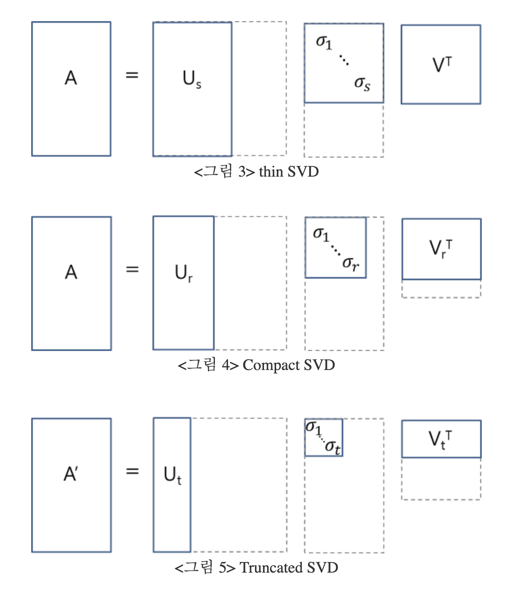

# Feature Extraction: LSA & t-SNE

## Singular Value Decomposition: SVD
- 실수 행렬 또는 복소 행렬의 분해 (A factorization of a real or complex matrix)
- m by n (m > n) 크기의 직사각 TDM 행렬 A 
$$ A = U \Sigma V^T $$

### Properties of SVD (SVD의 특성)
- 행렬 U와 V는 직교행렬 (Singular vectors of the matrix U and V are orthogonal)
$$ U^TU = V^TV = I$$
-  $\Sigma$ 의 특이값 (positive singular value) 개수 = Rank(A)
- Running time: O(mnc)
	- c: the average number of words per document 

### Reduces SVDs (SVD 축소) 
  
이미지 및 내용 출처: https://darkpgmr.tistory.com/106  

- Thin SVD: Transform $\Sigma$ to a square matrix & remove the corresponding columns of U ($\Sigma$에서 대각파트가 아닌 0으로 구성된 부분을 없애고 U에서는 이에 대응되는 열벡터들를 제거)
- Compact SVD: Reduce $\Sigma$ by removing zero-singular values and corresponding vectors in U and V (비대각 원소들뿐만 아니라 0인 singular values까지 모두 제거)
- **Truncated(Approximated) SVD**: Preserve top t largest singular values in $\Sigma$ and their corresponding vectors in U and V (Top k개의 가장 큰 singular values만 보존,  0이 아닌 singular value까지 제거한 형태로서 원래의 A가 보존되지 않고 A에 대한 근사행렬 A'이 나옴)
---
## Latent Semantic Analysis (LSA)
### Latent Semantic Indexing
- 고차원 공간을 저차원 공간으로 변환하여 TDM의 통계적 구조를 드러내는 과정 (A process of term-document matrix to expose statistical structure by converting a high dimensional space to lower dimensional space)
	- feature 수 뿐만 아닌 문서 수를 줄이는 데에도 사용할 수 있다 (Can be used to not only reduce the number of features, but also to reduce the number of documents)
- Latent: 명시적이지 않은 연관 관계를 포착(Captures associations which are not explicit)
- Semantic: 다른 엔티티 간의 유사성 자체가 저차원으로 변환된 이후에도 보존이 될 수 있도록 하겠다 (represent meaning as a function of similarity to other entities)

### SVD를 통한 차원 축소
- 상위 k개만을 사용한 Truncated SVD를 이용하여 원본 TDM 행렬 $A$를 $A_k$로 근사
   $$ A \approx A_k = U_k\Sigma_kV_k^T$$
- 양변에 $U_k^T$를 곱해준다. m * n 행렬에서 -> k * n으로 축소된 TDM 행렬을 얻는다.
   $$ U_k^TA_k = U_k^TU_K\Sigma_kV_k^T = I\Sigma_kV_k^T = \Sigma_kV_k^T$$
- 양변에 $V_k$를 곱해주면 m * k 행렬인 $U_k \Sigma_k$ 가 남게된다. 즉 **n개의 Term이 k개의 차원으로도 축소가 될 수 있다. 따라서 SVD는 반드시 문서가 기준이 아니라 Term이 기준이 될 수도 있다.** 보존되는 정보량은 특이값(positive singular value)의 개수에 따라 정해진다.

---
## Stochastic Neighbor Embedding (SNE)
- **local distance를 보존하는 것이 non-local distance를 보존하는 것보다 중요하다.**
	- 가까이 있는 점들 사이의 거리를 보존하는 것이 먼 점들 사이의 거리를 보존하는 것보다 중요하다는 뜻이다.
	- 고차원 공간에서 가까운 점들은 유사한 특성을 가지는 경우가 많아서 이를 잘 보존하면 저차원 공간에서도 데이터의 본래 구조를 잘 유지할 수 있다.
	- 시각화적인 측면에서도 저차원 공간에서도 클러스터나 패턴이 더 명확하게 드러난다.
- **SNE는 distance가 local인지는 probabilistic하게 결정하겠다.**
	- 확률 분포로써 처리하는 것에 대한 이점은 비선형적 관계를 더 잘 반영할 수 있다.
	- 노이즈나 이상치에 대한 영향을 줄여준다. 어떤 노이즈에 의해 두 점 사이의 거리가 커져도 확률적으로 큰 의미를 갖지 않아 이상치에 대해 민감도가 낮다.
	- 거리에 따라 가중치를 부여하여 가까운 거리 정보에 집중할 수 있어 성능이 향상된다.
- **각각의 고차원 유사도를 하나의 데이터가 다른 데이터를 이웃으로 선택할 확률로 변환**
	- Probability of picking j given in high D   
	  $p_{j|i}$: 원 공간에서 j번째 객체가 i번째 객체의 이웃으로 선택될 확률
	- Probability of picking j given in low D   
	  $q_{j|i}$: 축소된 공간에서 객체 j가 객체i의 이웃으로 선택될 확률

$$p_{j|i} = \frac{e^{- \|x_i - x_j\|_2^2 / 2\sigma_i^2}}{\sum_k e^{- \|x_i - x_k\|_2^2 / 2\sigma_i^2}}$$

$$q_{j|i} = \frac{e^{- \|y_i - y_j\|_2^2}}{\sum_k e^{- \|y_i - y_k\|_2^2}}$$

### Picking the Radius of the Gaussian in P
- big radius leads to high entropy, 시그마가 크면 distribution이 넒게 퍼지므로 좀 더 멀리있는 j들도 $p_{j|i}$ 값이 커짐
-  small radius leads to a low entropy, 봉우리가 뾰족하게 올라간 형태이므로 $p_{j|i}$ 가 0에 가까워짐 
- SNE의 성능은 perplexity에 차이에 대해서 민감하지 않다(fairly robust하다).

### Cost Function for a Low-dimensional Representation
- Kullback-Leibler divergence
	- non-symmetric하다. ( distance(a,b)=distance(b,a)여야 하는데 KL divergence는 보존되지 않는다.)
$$ Cost = \sum_i KL (P_i||Q_i) = \sum_i\sum_j p_{j|i}log\frac{p_{j|i}}{q_{j|i}}$$
- Gradient
$$ \frac{\partial C}{\partial y_i} = 2 \sum_j (y_j - y_i) (p_{ij} - q_{ij} + p_{ji} - q_{ji}) $$
- Update the coordinate in the lower dimension to minimize the Cost function (비용 함수 최소화를 위한 저차원 좌표 업데이트)
	- Gradient update with momentum term
$$ y(t+1) = y(t) + \eta \frac{\partial C}{\partial y} - \alpha(t) [y(t) - y(t-1)]$$

### Symmetric SNE
- $p_{i|j}$와 $p_{j|i}$ 가 다르니(각각 i가 j의 이웃이 될 확률과 j가 i의 이웃이 될 확률임) 이를 symmentic 하게 바꿔보겠다
$$ p_{ij} = \frac{p_{i|j} + p_{j|i}}{2n} $$
- 이렇게 되면 gradient가 훨씬 단순하게 만들어진다.
$$ \frac{\partial C}{\partial y_i} = 4\sum_j(y_j-y_i)(p_{ij} - q_{ij})$$

### Crowding problem
- 가우시안 분포를 쓰기 때문에 봉우리가 비교적 높아서 거리가 길어지면 확률이 급격하게 감소한다. 
- 조금 더 꼬리가 두껍고 긴 분포를 가져 거리가 길어졌을 때에도 확률이 급격하게 떨어지는 것을 방지하고 싶다. 
- **정규분포 대신 t-분포 사용**  

### t-SNE
- 정규분포보다 꼬리는 높고 봉우리는 낮은 분포 사용하여 **Crowding Problem** 해소
- Optimization of t-SNE
	- Gradient
	  (SNE에 대한 연산을 할 수 있다면 t-SNE는 어렵지 않으므로 생략)
  
이미지 출처: https://github.com/oreillymedia/t-SNE-tutorial

### t-SNE Examples
- Olivetti faces datasets
- CalTech-101
- Wiki t-SNE
- Embedding Projector by Google

---
## 요약
- 특성 추출(Feature Extraction)  
	- LSA  
		- Reduced SVD 중 **Truncated(Approximated) SVD**를 이용하여 Top k 개의 singular values를 선택하여 차원 축소  
		- **Truncated(Approximated) SVD**: 원래의 A가 보존되지 않고 A에 대한 근사행렬 A'를 구하며, 보존되는 정보량은 positive singular vaue의 개수에 따라 정해진다
	- t-SNE  
		- local distance를 보존하는 것이 non-local distance를 보존하는 것보다 중요하다.  
		- 각각의 고차원 유사도를 **하나의 데이터가 다른 데이터를 이웃으로 선택할 확률**로 변환  
		- 정규분포보다 꼬리는 높고 봉우리는 낮은 분포 사용하여 SNE에서 발생하는 **Crowding Problem** 해소  