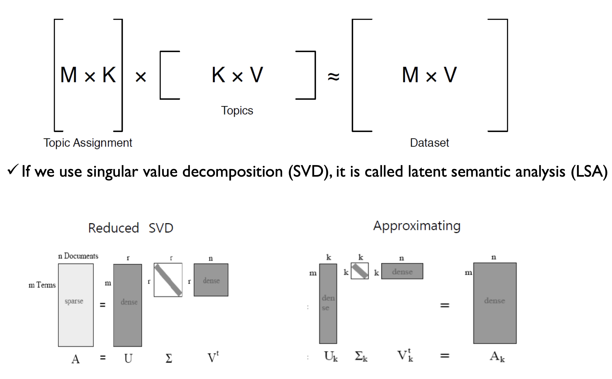
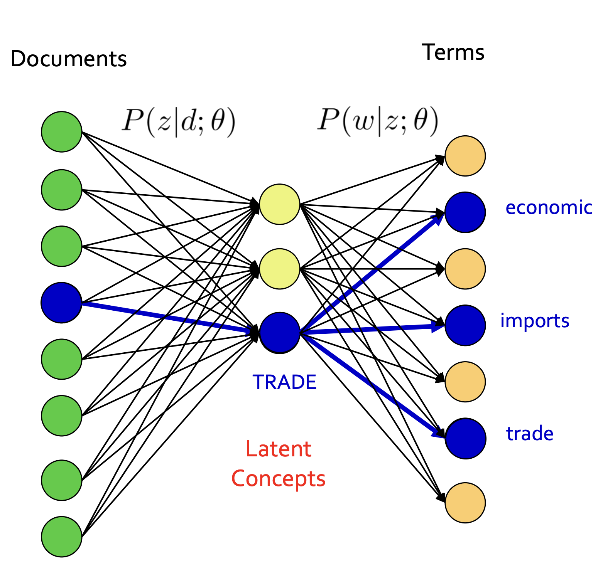
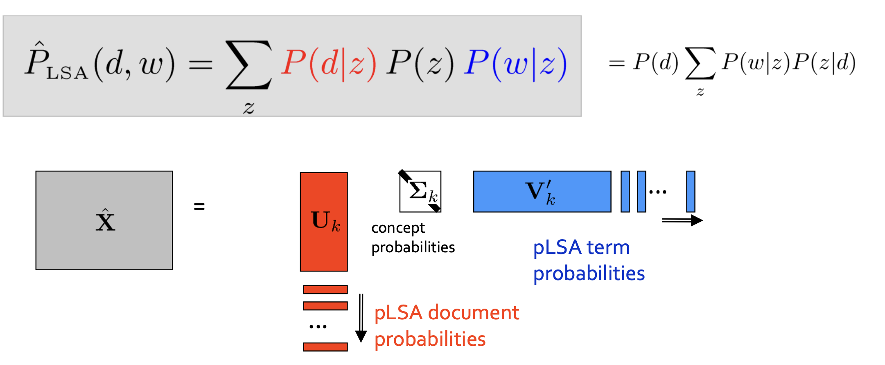
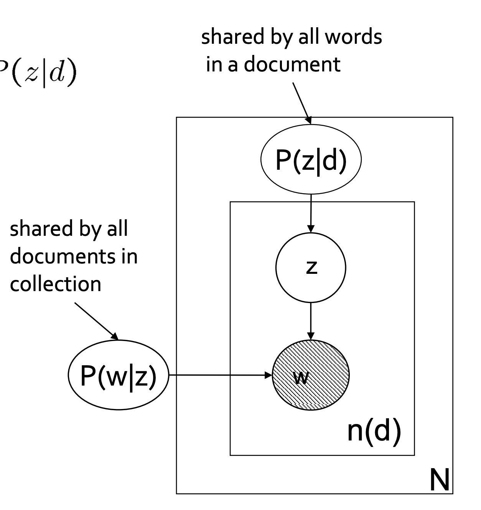

> [ 07-1: Topic Modeling Part 1 (LSA & pLSA)](https://youtu.be/J1ri0EQnUOg)
# Topic Modeling

## Topic Models 
- Topic Extraction
	- 문서(예: 논문)들을 토픽에 맞게 분류
- Relation between Topics
	- 각각의 토픽들도 단어만큼의 차원으로 이루어진 연속형의 벡터로써 표현할 수 있다.
	- 토픽 간에도 더 유사한 토픽과 덜 유사한 토픽이 있다.
- Trend Analysis
	- Hot Topic (최근에 연구가 활발히 진행되는 토픽)
	- Cold Topic (상대적으로 과거에 비해 현재 연구가 덜 되는 토픽)
- Document Retrieval
## Topic Model: Approach
### Matrix Factorization Approach

- m개의 Terms이 있고 n개의 Doucments이 있을 때  $U^T_k$를 양변에 곱하여 나오는 $k \times n$ Matrix는 결국 "n개의 문서는 k개의 토픽들로 이루어져 있다." 라고 해석할 수 있다.
#### Disadvantage of LSA
- SVD는 normally distributed data여야한다. 
  (실제 데이터는 TF-IDF를 사용하거나 Binary Representation으로 표현된 Bag-Of-Word 모델을 사용하게 되는데, 대부분이 Spare하고 Term의 등장빈도가 전혀 정규분포가 아님)
- 그럼에도, TF-IDF같은 weighted matrix를 사용했을 때는 상대적으로 잘 동작했다.

### Probabilistic Topic Model: Generative Approach 
- 가정: 각각의 document들은 topic들의 probability distribution(확률 분포)이다.
- Topic의 distribution 자체가 주어진 document의 핵심을 표현하고 있다. (=document를 topic의 비중으로 설명할 수 있다.)
- topic 하나하나는 단어들의 probability distribution이다.
	- Topic "Education": school, students, education, ...
	- Topic "Budget": million, finance, tax, program, ...

## Topic Model: Generative Approach  
- Model-based methods
	- 우리가 가정했던 확률적 모형을 최대한 잘 맞추도록 하는 것
	- 각각의 단어들이 이 text에서는 우리가 가정한 모델에 의하면 발생할 확률이 얼마인가를 추정
- How it work?
	- $P(D|h)$라는 조건부 확률을 정의
		- h라는 hypothesis를 통해서 D라는 dataset이 만들어진다.
		  "가정 h 하에서 데이터 D가 생성될 확률"
	- h라는 가정을 역으로 추정하는 과정을 통해 생성 확률을 가장 크게 하는 가정을 학습
		- 실제로 h라는 가정을 알지 못하기 때문에 관측된 데이터 D를 바탕으로 가정 h를 추정
		  (문서가 생성되는 프로시저를 정의해두고, 그 프로시저로부터 우리가 현재 관측하고 있는 수집했던 데이터가 생성되었을 것이다라는 믿음으로부터, 그 데이터를 생성하는 실제 가정은 무엇일까를 추론)

# Probabilistic Latent Semantic Analysis
## Latent Structure
- TDM이 주어졌을 때 문제점
	- 데이터가 매우 크고 복잡함
	- 사전에 정의된 구조가 없음 (Lack of structure)
- 그에 따른 질문
	- 해당하는 객체들을 쉽고 단순하게 설명할 수 있는 방법은 없을까?
	- 데이터를 관통하는 숨겨져 있는 latent structure가 있을 것이다.
	- 그 구조를 어떻게 찾을 수 있을까?
### LSA Decomposition (revisited)
- Matrix Factorization Approach 그림과 지난 강의 노트 참고!
- e.g.) 단어와 문서를 동일한 공간에 벡터로 표현할 수 있다. 
## Language Model: Naïve Approach
### Maximum likelihood estimation (MLE)
- **문서 d에서 단어 w가 나타날 확률**을 최대우도추정 (Maximum Likelihood Estimation) 방식으로 추정
$$\hat{P}_{ML}(w|d) = \frac{n(d, w)}{\sum_{w'} n(d, w')}$$
- $n(d, w)$: 문서 d에서 단어 w가 나타난 횟수
- $\sum_{w'} n(d, w')$: 모든 단어 w'에 대해 문서 d에서 단어 w'가 나타난 횟수를 모두 더함
### Language Model: Estimation Problem
- Zero frequency problem: 문서에 등장하지 않는 단어들이 0의 확률값을 가짐
- 특정한 문서 d가 주어졌을 때 단어 w가 등장할 확률을 다른 문서들을 이용하여 더 잘 추정할 수 있지 않을까? 
- 확률적 분포로 봤을 때 다른 문서에서 포함하는 정보를 이용하면 smoothing 된 확률을 추정할 수 있을 것
## Probabilistic Latent Semantic Analysis (pLSA)

- 문서와 단어 사이에 Latent Concepts (잠재적인 주제)를 도입하여, 주제와 단어 사이의 연결을 찾는 방식으로 문서 집합을 분석한다. 
- 앞에서는 Latent Concepts를 스킵하고 Documents와 Terms가 바로 이어졌는데, pLSA에서는 문서에서부터 컨셉으로 이어지고 그 컨셉으로부터 단어들이 생성되었다는 구조를 찾아내는 것이다.
- pLSA는 **사전 지식(prior knowledge)** 없이 **용어들의 동시 발생(term co-occurrences)** 정보만을 바탕으로 학습한다.
### pLSA: Latent Variable Model
$$\hat{P}_{LSA}(w|d) = \sum_z P(w|z; \theta) P(z|d; \pi)$$
- $\hat{P}_{LSA}(w|d)$: Document level language model, 문서 d에서 단어 w가 나타날 확률을 LSA 모델로 추정한 값
- $\sum_z$: 모든 가능한 latent topic z에 대한 합
- $P(w|z; \theta)$: 주어진 latent topic z에서 단어 w가 나타날 확률 (θ는 모델의 파라미터)
- $P(z|d; \pi)$: 문서 d에서 latent topic z가 나타날 확률 (π는 모델의 또 다른 파라미터)
### pLSA: Matrix Decomposition

- LSA와의 차이점
	- Non-negativity: U와 V의 모든 원소들이 0보다 크거나 같다.(확률의 개념으로 표현할 수 있어 유의미하다.)
	- Normalization: U에 해당하는 각각의 문서 vector들과 V에 해당하는 각각의 단어 vector의 합이 1이다. (확률로써 해석 가능)
### pLSA: Graphical Model

$$P(w|d) = \sum_z P(w|z) P(z|d)$$
- 바깥 네모: 문서 별 반복
- 안쪽 네모: 문서 내 단어별 반복
- P(w|z): 어떤 토픽이 주어지면 특정한 단어가 뽑힐 확률은 문서가 바뀐다고 변하지 않는다 (모든 코퍼스에 통용된다. 그래서 바깥 네모 밖에 있음)
- P(z|d): 현재 문서 d에서 토픽 z가 차지하는 비중
- w: 단어 w가 등장할 확률은 **현재 문서 d에서 토픽 z가 차지하는 비중**과 **토픽 z에서 해당하는 단어 w가 뽑힐 확률** 두 가지의 영향을 받아 만들어진다.
### pLSA: Parameter Inference
- 경쟁 문서 모음을 관찰할 확률은 모든 문서의 모든 단어를 해당 횟수만큼 관찰할 확률의 곱으로 주어진다.
  (모든 단어들이 독립적으로 생성된다는 가정)

- likelihood function becomes
	$$L = \prod_{i=1}^{m} \prod_{j=1}^{n} p(w_i, d_j)^{n(w_i, d_j)}$$
- The log-likelihood function becomes
	$$\begin{align}
	\mathcal{L} &= \sum_{i=1}^{m} \sum_{j=1}^{n} n(w_i, d_j) \log p(w_i, d_j) \\
	&= \sum_{i=1}^{m} \sum_{j=1}^{n} n(w_i, d_j) \log \left( \sum_{k=1}^{K} p(w_i|z_k) p(z_k) p(d_j|z_k) \right)
	\end{align}$$
- analytically하게 likelihood를 최대화할 수 없다. 
	- pLSA 목적함수는 Closed-form solution이 존재하지 않음
	- Expectation-Maximization (EM) 알고리즘을 사용하여 최적화 
### pLSA: EM Algorithm
- A와 B를 최적화하고 싶을 때, A 고정 & B 최적화 이후 B 고정 & A 최적화 과정을 반복하면 A,B 모두 수렴할 것이다. 
- E-Step: Posterior probability of latent variables (concepts)
- M-Step: Parameter estimation based on "completed" statistics

---

# 요약
- 토픽 모델링
	- 다음과 같은 Task를 수행할 수 있다.
		- Topic Extraction
		- Relation between Topics
		- Trend Analysis
		- Document Retrieval
- pLSA 등장 배경
	- 토픽 모델링 접근 방법
		- 행렬 분해 (LSA)
		- 확률론적 생성 방식 (pLSA)
	- LSA의 단점
		- SVD는 데이터가 정규 분포를 따라야한다.
	- pLSA
		- 가정: 각각의 document들은 topic들의 probability distribution(확률 분포)이다.
- pLSA
	- 가정 h 하에서 데이터 D가 생성될 조건부 확률을 정의하고, h라는 가정을 역으로 추정하는 과정을 통해 생성 확률을 가장 크게 하는 가정을 학습한다.
		- **문서 d에서 단어 w가 나타날 확률**을 최대우도추정 (Maximum Likelihood Estimation) 방식으로 추정
	- Zero frequency problem (문서에 등장하지 않는 단어들이 0의 확률값을 가짐)
		- 문서와 단어 사이에 Latent Concepts (잠재적인 주제)를 도입
	- analytically하게 likelihood를 최대화할 수 없음 (Closed-form solution이 존재하지 않음)
		- Expectation-Maximization (EM) 알고리즘을 사용하여 최적화 