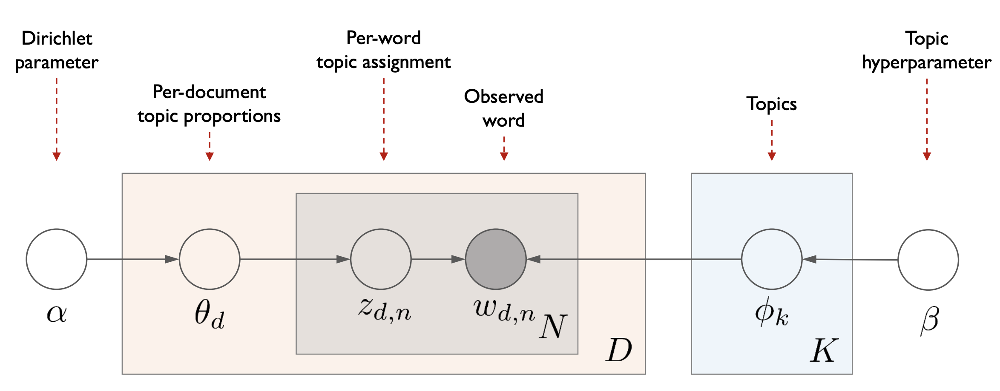

> [07-2: Topic Modeling Part 2 (LDA Document generation process)](https://youtu.be/WR2On5QAqJQ)
# LDA: Document Generation Process
## LDA: Intuition
### Documents exhibit multiple topics
- 각각의 토픽은 단어들의 분포이다.
- 각각의 문서는 mixture of corpus-wide topics(전체 corpus에 걸쳐있는 다양한 주제들의 혼합 형태)이다.
- 각각의 단어들은 토픽에서부터 샘플링을 통해 생성된다.
- 우리는 오직 문서만 관찰할 수 있으며, 다른 구조들은 hidden variables(숨겨진 변수들)이다. 
	- Q1. 각 토픽이 어떤 단어들과 어떤 분포로 이루어져있는지 모른다.
	- Q2. 해당 문서가 각 토픽들의 비중이 어떻게 구성되어있는지 모른다.
	- Q3. 문서에 해당하는 개별적인 단어들은 어느 토픽으로부터 추출되었는지 모른다.
- LDA의 목적은 이 hidden variables를 추정하는 것
- 문서가 주어졌을 때 P(**topics**(토픽의 분포), **proportions**(문서가 가지고 있는 토픽의 비중), **assignements**(각각의 단어들이 어느 토픽에서 뽑혔는지) | **documents**)를 추정

## LDA Overview
### Documents exhibit multiple topics

- Encode assumptions
- Define a factorization of the joint distribution
- Connect to algorithms for computing with data
### LDA structure
- D: 문서, N: 단어, K: 토픽 수 
- 노드들은 random variables(확률 변수), 엣지들은 dependence(의존성, 어디에 영향을 받는지)를 의미

## LDA Document generation process
1. $\beta$를 하이퍼파라미터로 갖는 Dirichlet distribution(디리클레 분포)로부터 각각의 토픽 $\phi_k$의 분포 추정
2. $\alpha$를 하이퍼파리미터로 갖는 Dirichlet distribution로부터 각각의 문서 $\theta_d$의 분포 추정
3. $\theta_d$를 하이퍼파리미터로 갖는 Multinomial distribution(다항 분포)로부터 $z_{d,n}$의 분포 추정
   ($z_{d,n}$는 각각의 단어가 어떤 토픽에 속할지를 나타내는 변수. 즉, 문서의 토픽 분포가 결정되었을 때 개별적인 단어들을 어떤 토픽에서 뽑아다 쓸 것인가를 결정하는 단계)
4. $\phi_{z_{d,n},n}$를 하이퍼파리미터로 갖는 Multinomial distribution로부터 각각의 단어 $w_{d,n}$의 분포 추정
### Term distribution per topic
- Topic들마다 각각의 단어들에 대한 분포로 나타낼 수 있다.
- 해당 분포는 디리클레 분포로 부터 나오는 것이다.
- 각각의 Topic들에 대해 단어의 발생확률을 모두 더하면 1이다.
### Topic distribution per document
- 문서별로도 토픽들의 비중으로 표현할 수 있다.
- 각 문서들의 토픽 비중(확률)의 합은 1이다.
### Topic to words assignments
- 각 문서의 포함되어 있는 단어들이 어느 토픽에서 가져왔는지를 할당
  (그 단어가 뽑힐 대상이 되는 토픽을 할당)
### Probabiliity of a corpus
- 각각의 단어 위치에 할당된 토픽에서 해당 토픽의 분포를 통해 실제로 단어를 생성
# 요약
> 참고자료: [딥 러닝을 이용한 자연어 처리 입문](https://wikidocs.net/30708)
